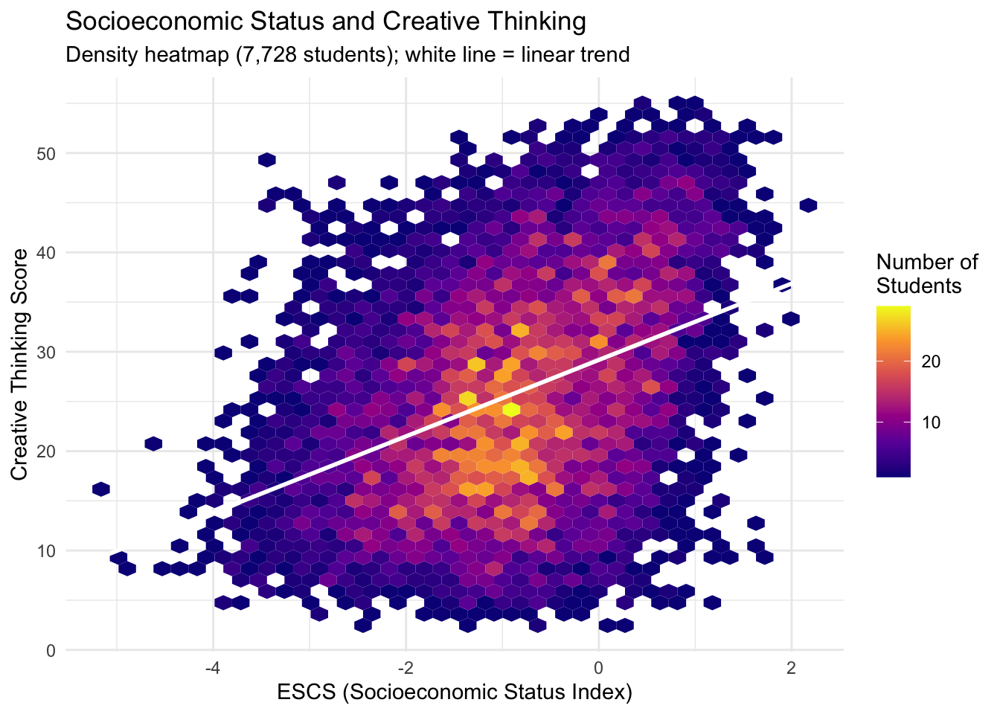
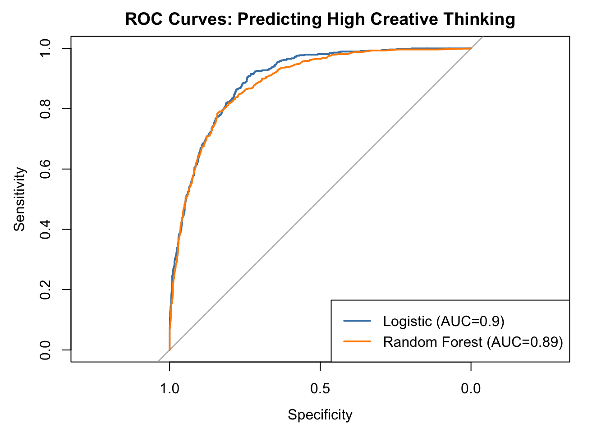
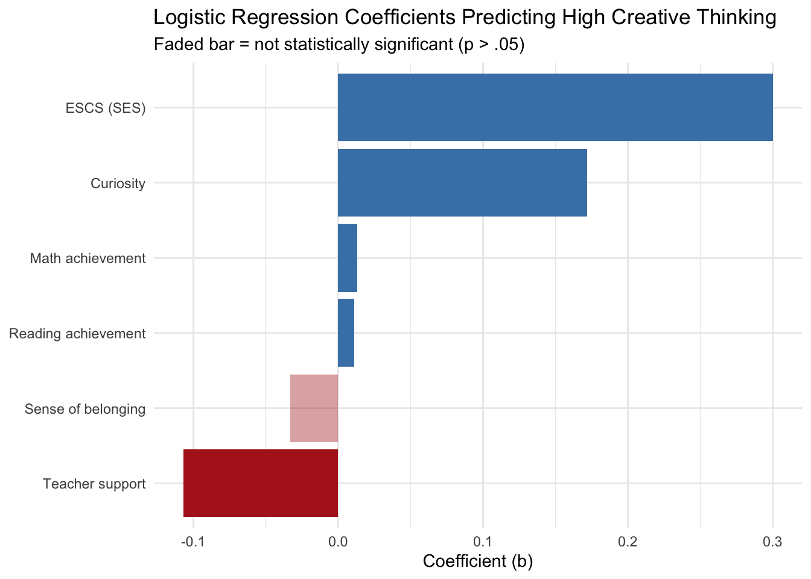
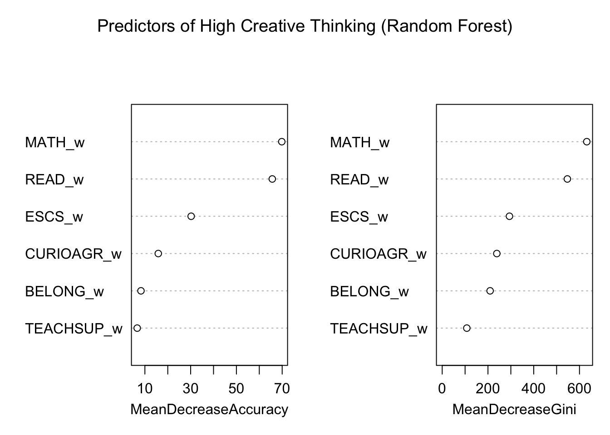
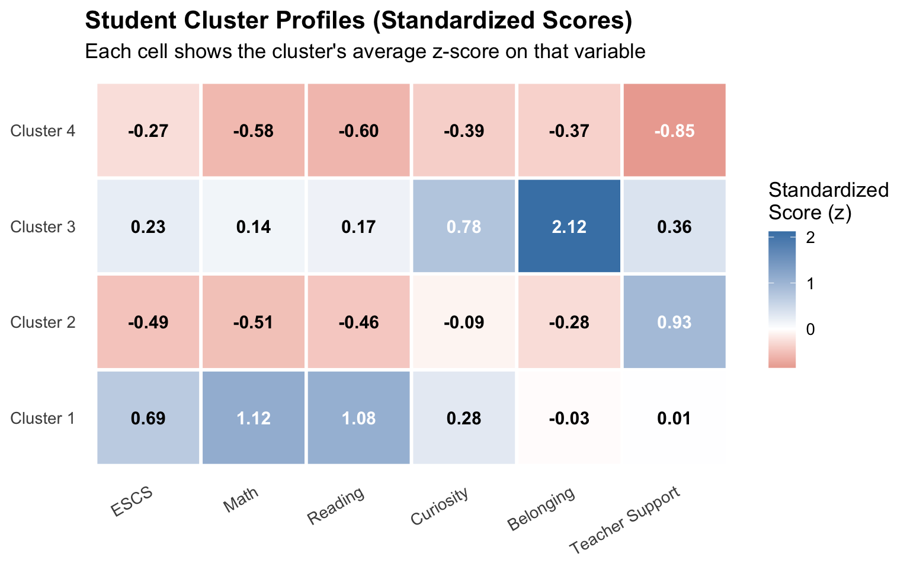
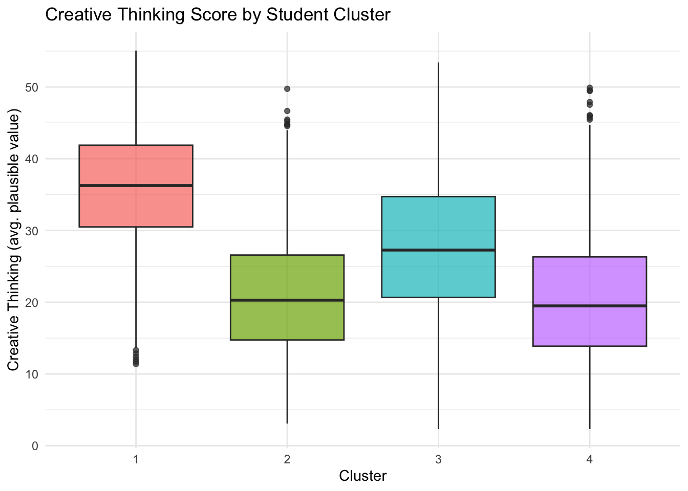
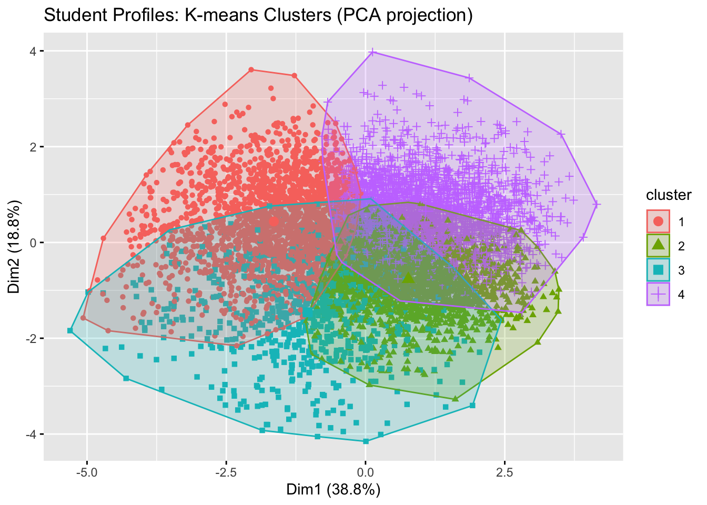

# Predictors of Creative Thinking in Brazil: A PISA 2022 Analysis

## Overview

This project examines factors associated with creative-thinking performance among Brazilian students using data from the **OECD Programme for International Student Assessment (PISA) 2022**.

Using statistical modeling, machine learning, and clustering methods in R, I explored how socioeconomic background, academic achievement, and student characteristics relate to creative-thinking performance.

The project addresses two research questions:

1. To what extent can socioeconomic status, mathematics and reading achievement, curiosity, sense of belonging, and teacher support predict high creative-thinking performance?
2. Can students be grouped into meaningful profiles based on these characteristics, and do creative-thinking outcomes differ across those profiles?

---

## Data

The analysis combines the **PISA 2022 Student Questionnaire** and **Creative Thinking Assessment** datasets for Brazil.

After merging the datasets and removing observations with missing values on the main analytical variables, the final analytic sample included **7,728 students**.

Variables included:

- Socioeconomic status (ESCS)
- Mathematics achievement
- Reading achievement
- Curiosity
- Sense of belonging
- Teacher support
- Creative-thinking performance

Students were classified as high creative-thinking performers if their creative-thinking score fell within the top 25% of the Brazilian analytic sample.

---

## Methods

The analysis was conducted in **R** and included:

- Data cleaning and preprocessing
- Exploratory data analysis
- Data visualization
- Logistic regression
- Random forest classification
- Train/test evaluation
- Five-fold cross-validation
- ROC and precision-recall analysis
- K-means clustering
- Principal component analysis (PCA) for cluster visualization
- Elbow and silhouette methods
- ANOVA

---

## Key Findings

### Socioeconomic Status and Creative Thinking

Creative-thinking performance increased substantially with socioeconomic status.

Approximately **9% of students in the lowest SES quartile** were classified as high creative-thinking performers, compared with approximately **48% of students in the highest SES quartile**.

The density heatmap below shows the relationship across the full analytic sample of 7,728 students.

Creative-thinking scores generally increase with socioeconomic status, although substantial variation exists at every SES level.

---

### Predicting High Creative-Thinking Performance

Two classification models were compared: **logistic regression** and **random forest**.

| Model | Accuracy | Recall | F1 | AUC |
| --- | ---: | ---: | ---: | ---: |
| Logistic Regression | 0.835 | 0.551 | 0.625 | 0.898 |
| Random Forest | 0.836 | 0.582 | 0.639 | 0.888 |

Both models demonstrated strong overall discriminatory performance.

Five-fold cross-validation produced similar AUC values, suggesting that model performance was not dependent on a single train/test split.

However, both models were better at identifying students who were not high performers than identifying all students who were high performers.

---

### Important Predictors

Logistic regression showed positive associations between high creative-thinking performance and:

- Socioeconomic status
- Mathematics achievement
- Reading achievement
- Curiosity

Sense of belonging was not statistically significant.

Teacher support showed a small negative association after accounting for the other predictors. Because the analysis is cross-sectional, this relationship should not be interpreted as evidence that teacher support causes lower creative-thinking performance.

Random forest variable importance similarly identified **mathematics achievement, reading achievement, and socioeconomic status** as the strongest predictors.

---

## Student Profile Analysis

### K-Means Clustering

K-means clustering was used to identify groups of students with similar socioeconomic, academic, and school-experience characteristics.

The clustering analysis included:

- Socioeconomic status
- Mathematics achievement
- Reading achievement
- Curiosity
- Sense of belonging
- Teacher support

Creative-thinking performance was **not used to form the clusters**. Instead, creative-thinking outcomes were compared after the student profiles had been identified.

The number of clusters was evaluated using both the elbow method and silhouette scores. A four-cluster solution was retained because it provided more detailed and educationally interpretable student profiles.

### Student Cluster Profiles

The four clusters represented distinct combinations of student characteristics:

**Cluster 1**
- Higher socioeconomic status
- Higher mathematics achievement
- Higher reading achievement
- Highest creative-thinking performance

**Cluster 2**
- Lower socioeconomic status and academic achievement
- Relatively high teacher support

**Cluster 3**
- Higher curiosity
- Stronger sense of belonging

**Cluster 4**
- Below-average values across most characteristics

---

### Creative-Thinking Outcomes Across Clusters

Creative-thinking outcomes differed substantially across the four student profiles.

| Cluster | Students | Mean Creative Thinking | High Performers |
| --- | ---: | ---: | ---: |
| 1 | 2,234 | 36.0 | 61.2% |
| 2 | 2,083 | 21.0 | 7.3% |
| 3 | 761 | 27.8 | 27.9% |
| 4 | 2,650 | 20.4 | 7.7% |

A one-way ANOVA showed statistically significant differences in mean creative-thinking scores across the four clusters.

The most socioeconomically and academically advantaged student profile had substantially higher creative-thinking outcomes than the more disadvantaged profiles.

---

### PCA Visualization of Student Profiles

Principal component analysis (PCA) was used to visualize the four clusters in two dimensions.

The PCA projection illustrates both separation and overlap among the four student profiles.

The clustering itself was conducted using the full set of standardized variables rather than the two PCA dimensions. PCA is used here as a visualization tool to provide an interpretable two-dimensional representation of the cluster structure.

---

## Key Takeaways

The predictive and clustering analyses point to several consistent patterns:

- Socioeconomic status is strongly associated with differences in creative-thinking performance.
- Mathematics and reading achievement are among the strongest predictors of creative thinking.
- Curiosity provides additional predictive information beyond socioeconomic status and academic achievement.
- Students can be grouped into distinct socioeconomic, academic, and school-experience profiles associated with substantially different creative-thinking outcomes.
- Predictive models can help identify broad patterns but are less appropriate for high-stakes decisions about individual students.

Overall, the findings raise important questions about whether students from different socioeconomic backgrounds have equal opportunities to develop and demonstrate creative-thinking skills.

---

## Limitations

This project was designed as an exploratory learning-analytics analysis, and several limitations should be considered when interpreting the results.

**PISA methodology:** Plausible values were averaged into single scores rather than analyzed using the full OECD plausible-value methodology. PISA sampling weights were also not applied. The findings therefore describe the analytic sample and should not be interpreted as population-representative estimates for all Brazilian students.

**Missing data:** Complete-case analysis removed 3,070 observations, which may introduce selection bias if students with missing data differed systematically from those retained in the analysis.

**Cross-sectional design:** PISA 2022 is cross-sectional, so the relationships identified in this analysis should be interpreted as associations rather than causal effects.

**Outcome definition:** High creative-thinking performance was defined as the top 25% of the Brazilian analytic sample rather than an official OECD proficiency benchmark.

**Cluster selection:** The silhouette method favored a two-cluster solution, while four clusters were retained because they provided more detailed and educationally interpretable student profiles.

---

## Tools & Skills

**Programming & Data Analysis**

- R
- RStudio
- tidyverse
- Data cleaning
- Data wrangling
- Data visualization

**Statistical & Machine-Learning Methods**

- Logistic regression
- Random forest
- Classification
- Cross-validation
- ROC analysis
- Precision-recall analysis
- K-means clustering
- Principal component analysis
- ANOVA

**Domain**

- Educational Data Mining
- Learning Analytics
- International education data
- PISA
- Education equity

---

## Data Availability

This project uses publicly available data from the **OECD PISA 2022 Database**.

The analysis combines:

- PISA 2022 Student Questionnaire
- PISA 2022 Creative Thinking Assessment

Raw PISA datasets are not included in this repository due to their size.

---

## Full Report

The complete report, including methodology, interpretation, visualizations, limitations, and references, is available here:

[View Full Report](report/final_report.pdf)

---

## Author

**Emy Yamamoto**

M.S. Learning Analytics  
Teachers College, Columbia University
